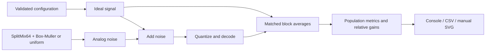

# adc-oversampling-enob

A zero-dependency Rust CLI that simulates ideal ADC quantization, seeded analog dither, and block averaging to measure effective-resolution improvement.

Under independent, zero-mean noise, **4x oversampling gives approximately +1 bit** of random-error resolution: 2x gives +0.5 bit, 16x +2 bits, 64x +3 bits, and 256x +4 bits. Averaging reduces standard deviation as `1/sqrt(M)`. It does not fix ADC calibration or guarantee greater absolute accuracy.

## Quick start

Install a current stable Rust toolchain with Cargo, rustfmt, and clippy. No third-party Rust dependencies, plotting packages, or network services are used.

```sh
git clone https://github.com/andrii2g/adc-oversampling-enob.git
cd adc-oversampling-enob
cargo run --release
cargo run --release -- --help
cargo run --release -- --noise none --out results/no-dither
cargo run --release -- --bits 10 --out results/10-bit
cargo run --release -- --noise uniform --noise-lsb 0.5 --out results/uniform
cargo run --release -- --signal ramp --ramp-start 0.1 --ramp-end 3.2 --out results/ramp
cargo run --release -- sweep --out results/sweep
```

The default experiment uses a 12-bit ADC, Vref 3.3 V, constant input 1.234567 V, Gaussian noise with 0.75 LSB standard deviation, 1,048,576 raw samples, seed 42, and OSRs 1, 4, 16, 64, 256.

## Example results

The default release run produces the following values (excerpt from the full console table):

| OSR | Output samples | Bias (LSB) | StdDev (LSB) | RMSE (LSB) | StdDev gain (bits) | Ideal gain |
| ---: | ---: | ---: | ---: | ---: | ---: | ---: |
| 1 | 1,048,576 | -0.001557 | 0.804043 | 0.804044 | 0.000000 | 0 |
| 4 | 262,144 | -0.001557 | 0.401867 | 0.401870 | 1.000553 | 1 |
| 16 | 65,536 | -0.001557 | 0.201738 | 0.201744 | 1.994791 | 2 |
| 64 | 16,384 | -0.001557 | 0.101064 | 0.101076 | 2.991996 | 3 |
| 256 | 4,096 | -0.001557 | 0.050289 | 0.050313 | 3.998963 | 4 |

The raw dataset visits 9 codes, from 1528 through 1536. SNR and SNR-derived ENOB are N/A because removing DC from a constant reference leaves zero AC signal power. The full console also reports RMSE-derived gain, seed, signal/noise parameters, Vref, and LSB size.

## Generated artifacts

A normal run writes these files under `--out` (default `results`):

| File | Contents |
| --- | --- |
| `summary.csv` | One row per OSR, configuration and all reported metrics |
| `enob-vs-osr.svg` | Observed StdDev-derived bit gain and theoretical gain |
| `rmse-vs-osr.svg` | RMSE in original ADC LSB units |
| `error-histogram-osr-1.svg` | Raw error distribution |
| `error-histogram-osr-16.svg` | Error distribution after 16-sample averaging, when selected |
| `error-histogram-osr-256.svg` | Error distribution after 256-sample averaging, when selected |

Open SVG files directly in a browser and CSV files in a spreadsheet. All SVGs are self-contained XML with no scripts, external assets, or font downloads. OSR chart positions are equally spaced categories, with actual OSRs labeled. Histograms use separate fixed-width ranges in original ADC LSB units; compare their labeled axes, not bar positions alone.

Undefined metrics are `N/A` in the console and empty CSV fields. An undefined observed gain is omitted from the plotted series; an all-undefined series receives an N/A annotation.

Runs overwrite their named outputs, without timestamps, elapsed times, or output-directory paths in report content. Other files in the output directory are retained, including charts from earlier configurations and sweep output. Use a separate directory for each configuration to avoid mixing old artifacts. The default `results/` and build `target/` directories are ignored by Git; custom output directories elsewhere are not automatically ignored.

### CSV format

`summary.csv` and `sweep.csv` share this column order:

```csv
bits,vref,lsb_volts,signal,noise,noise_lsb,seed,input_samples,osr,output_samples,bias_lsb,stddev_lsb,rmse_lsb,snr_db,snr_enob,rmse_gain_bits,stddev_gain_bits,theoretical_gain_bits,raw_unique_codes
```

Voltages use volts; error columns use the original ADC LSB; gain columns use bits. Floating-point fields use scientific notation with 12 digits after the decimal, a dot decimal separator, and no locale-dependent formatting. Files use LF line endings. The `signal` field includes voltage parameters as `constant(voltage)` or `ramp(start;end)`; `noise` is `none`, `uniform`, or `gaussian`. `noise_lsb` retains the configured amplitude even when noise is disabled.

Rows are ordered by ascending OSR. Sweep rows are ordered first by amplitude, then by OSR. Raw code range appears in the console; `raw_unique_codes` appears in both console and CSV.

## Why dither helps, and when it fails

With no dither and a constant input, every conversion returns the same code. Averaging that sequence adds no threshold-crossing information:

```sh
cargo run --release -- --noise none --out results/no-dither
```

For the default voltage this produces exactly one raw code, 1532. Every OSR retains the same 0.014586 LSB RMSE and zero RMSE gain; standard deviation is zero and its relative gain is undefined (N/A). The orange ideal-gain line is a conditional theoretical prediction, not a claim that this experiment achieves it.

Suitable noise applied **before** quantization causes neighboring codes to occur with probabilities related to the analog voltage's position between levels. Their average can represent a fractional code. Gaussian amplitude means standard deviation; uniform amplitude means half-width, so uniform noise at A LSB has standard deviation `A/sqrt(3)` LSB.

```sh
cargo run --release -- --noise gaussian --noise-lsb 0.75
cargo run --release -- --noise uniform --noise-lsb 0.5 --out results/uniform
```

Too little noise may never cross a threshold. Correlated noise need not average down as predicted. Clipping near the rails biases measurements. Large dither increases raw absolute error even when its random component averages down. A low-spread result can still have substantial systematic error.

## Mathematical model

The [mathematical reference](docs/MATH.md) defines the quantizer, error metrics, and assumptions:

```text
max_code = 2^bits - 1
LSB = Vref / max_code
code = round(clamp(v_true + noise, 0, Vref) / Vref * max_code)
decoded_voltage = code / max_code * Vref

reference_group = mean(true signal samples in the group)
measured_group = mean(decoded samples in the same group)
error = measured_group - reference_group

bias = mean(error)
variance = mean((error - bias)^2)       [population variance]
RMSE = sqrt(mean(error^2))
RMSE^2 = variance + bias^2

StdDev_gain_bits(M) = log2(StdDev_1 / StdDev_M)
RMSE_gain_bits(M) = log2(RMSE_1 / RMSE_M)
ideal_gain_bits(M) = 0.5 * log2(M)
```

Approximately `4^n` samples are needed for `n` ideal extra bits. Measured averages are never requantized to the original ADC resolution.

Ramps include both endpoints; a one-sample ramp uses its start. Both ideal and measured ramp streams are averaged over the same windows. This measures conversion error relative to the group mean, not the first sample. Averaging changes temporal resolution and output sample rate.

For nonconstant references, AC SNR is `20*log10(rms(reference - mean(reference))/RMSE)`; the program also reports `(SNR_dB - 1.76)/6.02`. That conversion conventionally assumes a full-scale sine and ideal quantization. Its use here for a ramp is comparative, **not a standards-grade ADC ENOB measurement**. Equal-endpoint ramps and single-output groups have no AC signal and report N/A. Zero error also leaves SNR undefined in this implementation. Relative gains require both baseline and current errors to be positive and finite.

## Sweep mode

```sh
cargo run --release -- sweep --noise gaussian --out results/sweep
cargo run --release -- sweep --noise uniform --out results/uniform-sweep
```

Sweep runs amplitudes `0, 0.05, 0.10, 0.25, 0.50, 0.75, 1.00, 2.00` LSB, overriding `--noise-lsb`. Each run restarts SplitMix64 with the same seed, so amplitudes compare identical underlying random draws. The other CLI options apply to every run. Selecting `--noise none` disables noise throughout the sweep.

The console prints each amplitude's report. `sweep.csv` contains one row per amplitude × OSR (40 data rows by default), using the same 19-column schema as `summary.csv`. Sweep mode writes only this combined CSV; normal runs produce the SVG charts.

## CLI reference

The default command is a single experiment; `sweep` is the only positional subcommand.

| Option | Default | Meaning |
| --- | --- | --- |
| `--bits` | `12` | ADC resolution, 2 through 24 |
| `--vref` | `3.3` | Finite positive reference voltage |
| `--samples` | `1048576` | Positive raw sample count |
| `--seed` | `42` | Unsigned 64-bit PRNG seed |
| `--signal` | `constant` | `constant` or `ramp` |
| `--voltage` | `1.234567` | Constant voltage |
| `--ramp-start` | `0.1` | Inclusive start voltage |
| `--ramp-end` | `3.2` | Inclusive end voltage |
| `--noise` | `gaussian` | `none`, `uniform`, or `gaussian` |
| `--noise-lsb` | `0.75` | Finite nonnegative sigma (Gaussian) or half-width (uniform) |
| `--osr` | `1,4,16,64,256` | Comma-separated powers of two |
| `--out` | `results` | Output directory |
| `--histogram-bins` | `80` | Bin count, at least 2 |
| `--help` | — | Usage |
| `--version` | — | Package version |

OSRs are sorted and deduplicated, and OSR 1 is automatically inserted as the baseline. Every OSR must divide the raw sample count exactly; no samples are silently dropped. Signal voltages may lie outside the rails to explore clipping, but must be finite. Descending and equal-endpoint ramps are accepted. Invalid options and configurations exit with status 2 and a help hint. Output failures also exit 2.

For a quick small experiment:

```sh
cargo run --release -- --samples 4096 --osr 1,4,16 --histogram-bins 40
```

## Architecture and reproducibility



See the [design documentation](docs/DESIGN.md) for module boundaries, data flow, and numerical decisions. `src/lib.rs` exposes the numerical modules to integration tests; `src/main.rs` handles command dispatch and filesystem output.

Each experiment generates one raw dataset and derives all OSRs from it. SplitMix64 uses explicit wrapping arithmetic and 53-bit uniform samples. Gaussian generation uses Box-Muller with a cached spare and a strictly positive logarithm argument. Block means sum deviations from a local origin so constant inputs remain exactly constant in floating-point arithmetic. Statistics use Welford population variance and scaled RMS accumulation.

For identical configuration, binary, and platform, report data and generated files are byte-identical, including on repeated runs into an existing output directory. Tests compare independently generated metrics, console text, CSV, and all SVGs. Integer PRNG outputs have fixed regression vectors. Floating-point transcendental functions can differ across operating systems or toolchains, so cross-platform bit-identical Gaussian results are not promised.

The CLI uses memory proportional to raw sample count plus retained decimated errors. A million-sample default is intended for desktop use; sweep mode retains eight experiment results. Extremely large counts can exhaust memory. Unrepresentable numeric scales are rejected rather than emitted as invalid report values.

## Resolution versus accuracy and limitations

This is an ideal quantizer experiment, not a hardware calibration model. Averaging can improve precision and reveal fractional-code information; it cannot repair reference error, offset, gain error, sensor bias, INL/DNL, or missing codes. A 12-bit ADC with oversampling is not thereby a calibrated 16-bit ADC.

The model excludes correlated noise, reference drift, aperture jitter, spectral analysis, anti-alias filters, and real hardware interfaces. The ideal gain assumes sufficiently independent stationary noise, threshold crossing, and no clipping-dominated regime. For changing signals, consider bandwidth and the averaging window as well as the reported group-mean error.

## Tests and CI

```sh
cargo fmt --all -- --check
cargo test --all-targets
cargo clippy --all-targets -- -D warnings
cargo build --release
```
