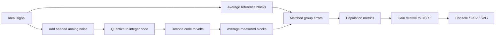

# Design and implementation

`adc-oversampling-enob` is a Rust 2024 CLI and library for studying ideal ADC quantization, independent analog noise, and block averaging. It uses only the standard library. The [README](../README.md) covers commands and report formats; [MATH.md](MATH.md) defines the numerical model.

## Experiment pipeline

Each experiment generates one raw dataset and derives all selected OSRs from that dataset. Noise is applied before quantization so it can exercise neighboring thresholds. Decoded voltages and ideal references are averaged over identical sample windows. Averaged measurements are not requantized, preserving fractional-code information.

## Module boundaries

| Module | Responsibility |
| --- | --- |
| `main` | Command dispatch, output directories/files, console output, exit status |
| `cli` | Manual argument parsing, help/version output, parse errors |
| `config` | Defaults, configuration validation, OSR normalization |
| `adc` | Ideal quantization, clipping, voltage decoding, LSB size |
| `signal` | Constant signals and inclusive-endpoint ramps |
| `rng` | SplitMix64 and 53-bit uniform conversion |
| `noise` | None, uniform, and Box-Muller Gaussian analog noise |
| `oversample` | Matched block averaging and decimation |
| `stats` | Population statistics, RMS, SNR, ENOB, and relative gains |
| `experiment` | Raw dataset generation, per-OSR analysis, seeded sweeps |
| `histogram` | Deterministic fixed-width bins independent of rendering |
| `report` | Stable console and CSV formatting |
| `svg` | XML escaping and standalone charts |

`lib.rs` exposes these modules so integration tests can exercise the numerical pipeline directly. The binary orchestrates library calls and filesystem operations.

## Configuration and signal semantics

Configuration accepts 2–24 ADC bits, finite positive Vref, a positive sample count, finite signal voltages, finite nonnegative noise amplitude, and at least two histogram bins. Ramp spans must also be finite.

OSRs are positive powers of two that divide the raw sample count exactly. Validation rejects an empty list or invalid factors, then sorts and deduplicates the list and inserts OSR 1 as the baseline. No partial blocks are retained or silently discarded.

Constant samples equal the configured voltage. Ramps include both endpoints; a one-sample ramp uses its start. Descending ramps and equal endpoints are supported. Voltages outside the ADC rails are permitted for clipping experiments; the ideal reference remains unclipped.

Uniform amplitude A means a half-width of A original ADC LSBs. Gaussian amplitude A means a standard deviation of A LSBs. Noise mode `none` returns exactly zero regardless of the configured amplitude.

## Data and numerical behavior

`RawDataset` holds reference voltages, decoded measurement voltages, and integer ADC codes. `OversamplingResult` retains each factor's metrics, relative gains, output count, and errors in original LSB units. `ExperimentResult` combines those results with the normalized configuration, ADC LSB, and raw code diagnostics.

The raw codes are sorted and deduplicated after numerical analysis to obtain their minimum, maximum, and unique count. One unique code is useful evidence that a constant input has not crossed a quantization threshold. Multiple codes alone do not establish unbiasedness or absolute accuracy.

Block means sum deviations from their first value. This is algebraically the arithmetic mean and preserves constant blocks exactly, preventing floating-point summation drift from appearing as oversampling gain.

Welford accumulation computes population variance, dividing by N rather than N−1. RMS uses scaled squares to avoid unnecessary intermediate overflow. Reference AC power is calculated after removing the group-reference mean. Reference variation at or below machine precision relative to its magnitude is treated as zero.

The reported metrics have distinct meanings:

- `snr_enob` converts AC SNR using the familiar sine-based formula; ramp results are comparative rather than standards-grade dynamic ENOB.
- `stddev_gain_bits` measures reduction in random error spread relative to OSR 1.
- `rmse_gain_bits` includes systematic bias as well as random spread and may plateau.

Constant references, equal-endpoint ramps, and single-output groups have no AC signal. SNR is also undefined when error RMS is zero or nonfinite. Relative gain requires positive finite baseline and current errors. Undefined metrics use N/A in the console, empty CSV fields, and gaps or annotations in the gain chart.

## Reproducibility and sweep behavior

SplitMix64 uses explicit wrapping integer arithmetic. Its uniform conversion uses 53 significant random bits in [0,1). Gaussian generation uses Box-Muller, a strictly positive logarithm argument, and a cached second deviate.

For identical configuration, binary, and platform, reports and artifacts are byte-identical. Formatting and sample traversal are deterministic, and outputs contain no timings, timestamps, or output-directory paths. Cross-platform Gaussian bit identity is not guaranteed because transcendental floating-point functions can differ.

Sweep mode runs amplitudes 0, 0.05, 0.10, 0.25, 0.50, 0.75, 1.00, and 2.00 LSB, overriding the single-run amplitude. Each experiment restarts the PRNG with the same seed. All other configured parameters remain in effect. The resulting `sweep.csv` has one row per amplitude and OSR.

## Output and failure behavior

A normal run renders the two OSR charts and histograms for factors 1, 16, and 256 when present. Histogram ranges are computed independently; equal-value data receives a nonzero-width range, and the maximum value belongs to the final bin. All bins count output samples, and their error axes use original ADC LSB units.

CSV uses a fixed schema and scientific notation with 12 digits after the decimal. SVG uses fixed geometry, escaped XML text, and no external assets. OSR plots use equally spaced categories labeled with the selected factors.

The binary creates the output directory and overwrites the files generated by the selected command. Other files, including artifacts from earlier configurations, remain. Sweep writes only the combined CSV. Writes occur per file and are not an atomic directory transaction; an I/O failure can leave a partial set of outputs.

Parsing and configuration validation occur before simulation and filesystem output. Errors are reported to stderr with exit status 2; CLI input errors include a help hint. The experiment also rejects unrepresentable noise scales, nonfinite noisy inputs, and nonfinite metrics. Histogram construction rejects unrepresentable ranges.

## Memory and scope

Raw storage uses two `Vec<f64>` streams and one `Vec<u32>` code stream, approximately 20 bytes per input sample before allocation overhead. Decimated samples and retained per-OSR errors add memory. Raw storage is released after each experiment; sweep retains the eight experiment results. Memory grows with sample count, and extreme counts can exhaust it.

The model excludes INL/DNL, missing codes, gain/offset errors, reference drift, aperture jitter, anti-alias filters, correlated noise, FFT analysis, and hardware interfaces. Relative precision gain does not imply calibrated absolute accuracy. See [MATH.md](MATH.md) for the assumptions behind the ideal oversampling gain.

## Verification

Unit tests cover the numerical modules and formatting. Integration tests cover subprocess behavior, generated files, byte determinism, scientific regressions, and numerical edge cases. Fixed RNG vectors catch algorithm changes; noise-distribution checks use deterministic samples and tolerances. The [CI workflow](../.github/workflows/ci.yml) checks formatting, clippy, all test targets, and a release build on Ubuntu.
